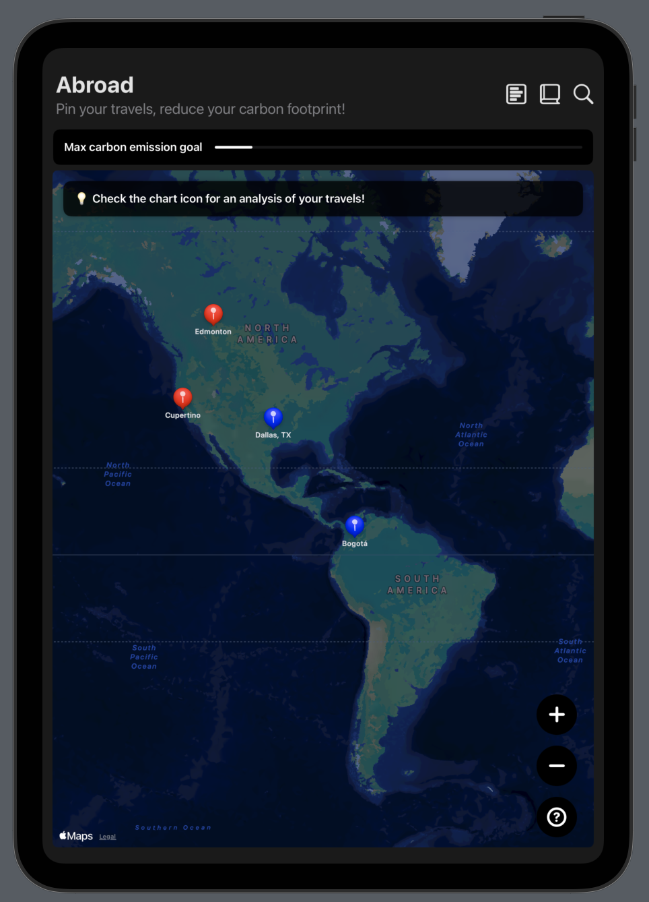

# Abroad-WWDC25

This is my submission for the WWDC 2025 Student Swift Challenge.

## What is Abroad and the inspiration behind it?

Abroad is a travel companion that lets users save trips while tracking sustainable metrics and encouraging eco-friendly travel choices.

The inspiration behind Abroad comes from my passion for travel and my commitment to sustainability. As a frequent traveler, I’ve always been fascinated by the diverse cultures, landscapes, and experiences that the world has to offer. However, I’ve also become increasingly aware of the environmental impact of travel and the importance of making sustainable choices. I wanted to create an app that combines my love for travel with my dedication to sustainability, offering users a way to explore the world responsibly while reducing their carbon footprint.

## Description

This project is a travel companion app that helps users plan, track, and reflect on their trips while promoting sustainable travel practices. Abroad is designed to streamline the travel experience, offering a range of features that make trip planning easy, efficient, and enjoyable. Users can save their trips, view detailed itineraries, and access region-specific eco-friendly tips to make informed choices that reduce their carbon footprint. The app also includes a journaling feature that allows users to record memories, jot down notes, and track their travel experiences for future reference.

Mainly, the apps purpose is to help users plan their trips, track their carbon footprint, and make sustainable choices. The app is designed to be user-friendly and intuitive, with a clean, modern interface that reflects Apple’s design principles. By combining practical trip planning tools with eco-friendly tips and journaling features, Abroad offers a comprehensive travel experience that encourages users to explore the world responsibly.

## Technologies

I wanted the user experience to be clean, intuitive, and distinctly Apple-inspired. I leveraged SwiftUI to build a dynamic, responsive interface that feels modern yet effortlessly familiar, incorporating subtle design touches reflective of Apple’s minimalist aesthetic. MapKit was my go-to for a robust and easy-to-navigate mapping experience, enabling users to save and revisit their trips seamlessly. For managing data, I chose Local storage and App Storage to keep the architecture simple and efficient.

In addition to these core elements, I built features that enhance trip planning—offering region-based eco-friendly tips that give practical, localized advice to help users make sustainable choices. I also integrated a journaling feature that allows users to record memories, jot down notes, and track their travel experiences for future reference. Overall, my goal with Abroad was to create an app that not only streamlines travel planning but also actively encourages greener travel habits through an elegant experience.

## Beyond the Swift challenge

Beyond the Swift challenge, I have used my coding skills to build projects that improve accessibility, safety, and well-being.

Mobility Mate helps elderly patients in physiotherapy track their recovery process, reducing the need for frequent visits to the clinic. It provides a simple, voice-assisted interface for a more accessible and engaging approach to care. Patients can track exercises and check in with Karen my AI assistant, while physiotherapists assign routines and review progress.

Safe Contact focuses on personal safety by keeping users connected with trusted contacts. Whether walking home alone or out at night, users can automatically share their location and respond to check-ins.

Nourished is a social, gamified wellness app that helps users track habits, set goals, journal progress, and receive AI-driven insights to build a healthier lifestyle. It encourages self-care through personalized recommendations, community engagement, and progress tracking, making wellness feel motivating rather than overwhelming. By fostering a supportive environment, Nourished helps users stay accountable and develop sustainable habits.

Github topics:
Travel, Sustainability, R
